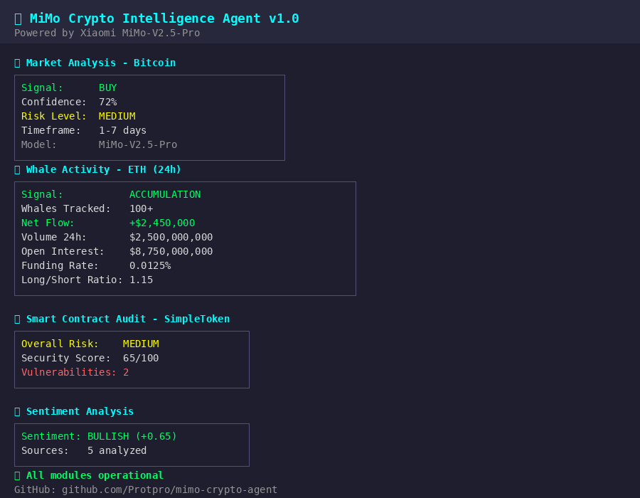

# 🤖 MiMo Crypto Intelligence Agent

> AI-powered crypto analysis platform built on **Xiaomi MiMo-V2.5-Pro**
> 
> Created for the [Xiaomi MiMo Orbit 100T Token Creator Incentive Program](https://100t.xiaomimimo.com/)

[](https://python.org)
[](https://mimo.xiaomi.com)
[](LICENSE)

---

## 🎯 What is this?

**MiMo Crypto Intelligence Agent** is a comprehensive crypto analysis toolkit that leverages **Xiaomi MiMo-V2.5-Pro's** advanced reasoning capabilities for:

- 🐋 **Whale Tracker** — 10 advanced features for tracking smart money
- 📊 **Market Intelligence** — AI-driven trading signals with deep reasoning
- 📰 **Sentiment Analysis** — Social media & news sentiment tracking
- 🛡️ **Contract Auditing** — Smart contract security analysis (Solidity/EVM)
- 🎁 **Airdrop Detection** — AI-powered airdrop opportunity discovery



## 🐋 Whale Tracker — 10 Advanced Features

The whale tracker is the core feature, providing comprehensive smart money analysis:

### 1. 🧠 Whale Wallet Profiling (Smart Money Score)
Score each whale wallet 0-100 based on win rate, ROI, timing accuracy, and consistency. Know which whales are actually profitable.

### 2. 🏦 Exchange Flow Analysis
Track whale deposits to exchanges (selling pressure) and withdrawals (accumulation). Net exchange outflow is bullish.

### 3. 🐋 vs 👥 Whale vs Retail Divergence
Detect when whales buy while retail sells (bullish divergence) or vice versa. One of the strongest signals in crypto.

### 4. 📊 Order Book Wall Detection
Scan large limit orders on exchanges. Buy walls = support. Sell walls = resistance. Detect spoofing risks.

### 5. 🔗 Cross-chain Whale Tracking
Track the same whale wallet across ETH, SOL, BSC, Arbitrum, Base, Optimism. When whales bridge funds, a move is coming.

### 6. 🏢 Smart Money VC Tracking
Monitor wallets of a16z, Paradigm, Coinbase Ventures, Polychain, Jump Trading, and more. When VCs move, rallies follow.

### 7. 📈 Historical Pattern Matching
Compare current whale behavior to historical patterns before major pumps/dumps. "This pattern is 80% similar to March 2024 pre-ATH."

### 8. 🔔 Whale Alert Threshold
Customizable alerts: "Notify me when any whale buys >$500k ETH". Chain-specific, direction-specific filters.

### 9. 📏 Whale Concentration Index (Gini Coefficient)
Measure how concentrated token holdings are. Gini = 0 (equal) to 1 (one holder has everything). High concentration = manipulation risk.

### 10. 🌡️ Whale Sentiment Heatmap
Visualize whale activity by hour/day. Identify when whales are most active for optimal entry/exit timing.

### Plus: Volume, OI, Funding Rate, Liquidation Levels
All features include real-time market metrics:
- **24h Volume** and volume change %
- **Open Interest (OI)** and OI change %
- **Funding Rate** (perpetual futures, annualized)
- **Long/Short Ratio**
- **Liquidation Levels** (5% up/down)

## 🧠 Why MiMo-V2.5-Pro?

MiMo-V2.5-Pro excels at this use case because of:

1. **Deep Reasoning** — Correlating whale behavior with derivatives data across 10 analysis modules
2. **Code Understanding** — Native Solidity comprehension for contract auditing
3. **Structured Output** — Reliable JSON for programmatic trading decisions
4. **Long Context** — Simultaneous analysis of 100+ whale transactions + market metrics
5. **Cost Efficiency** — 100T token program makes heavy daily usage accessible

## 🚀 Quick Start

### Prerequisites

- Python 3.9+
- MiMo API Key (from [platform.xiaomimimo.com](https://platform.xiaomimimo.com))

### Installation

```bash
git clone https://github.com/Protpro/mimo-crypto-agent.git
cd mimo-crypto-agent
pip install -r requirements.txt
cp .env.example .env
# Edit .env with your MiMo API key
```

### Usage

```bash
# Full whale analysis (all 10 features)
python main.py whale ETH

# Whale vs Retail divergence
python main.py whale ETH --divergence

# Holder concentration (Gini coefficient)
python main.py whale ETH --concentration

# Activity heatmap
python main.py whale ETH --heatmap

# VC wallet tracking
python main.py whale ETH --vc-tracking

# Smart Money ranking
python main.py whale ETH --smart-money

# Exchange flows
python main.py whale ETH --exchange-flows

# Cross-chain tracking
python main.py whale ETH --cross-chain 0x1234abcd...

# Order book walls
python main.py whale ETH --orderbook

# Historical pattern matching
python main.py whale ETH --historical

# Create alert (>$500k buys)
python main.py whale ETH --alert --min-usd 500000

# Market analysis
python main.py analyze bitcoin

# Sentiment analysis
python main.py sentiment "BTC ETH SOL"

# Smart contract audit
python main.py audit path/to/contract.sol

# Run demo (all modules)
python main.py demo
```

## 📦 Architecture

```
mimo-crypto-agent/
├── src/
│   ├── mimo_client.py          # MiMo API client (OpenAI-compatible)
│   ├── market_intelligence.py  # Market analysis engine
│   ├── sentiment_analyzer.py   # Sentiment analysis module
│   ├── whale_tracker.py        # Whale tracker (10 features, 100+ wallets)
│   ├── airdrop_detector.py     # Airdrop opportunity detector
│   └── contract_analyzer.py    # Smart contract auditor
├── main.py                     # CLI entry point
├── requirements.txt
├── .env.example
├── LICENSE
├── CONTRIBUTING.md
└── assets/
    └── demo.png                # Demo screenshot
```

## 🔧 API Integration

```python
from src.mimo_client import MiMoClient
from src.whale_tracker import WhaleTracker

client = MiMoClient()
whale = WhaleTracker(client)

# Full analysis with all 10 features
signal = whale.analyze_whale_activity("ETH", hours=24, include_all_features=True)

print(f"Signal: {signal.signal}")
print(f"Smart Money Score: {signal.smart_money_scores[0].smart_money_score}")
print(f"Exchange Net Flow: {sum(f.net_flow_usd for f in signal.exchange_flows)}")
print(f"Divergence: {signal.divergence.direction}")
print(f"Gini: {signal.concentration.gini_coefficient}")

# Generate alert
print(whale.generate_alert(signal))
```

## 🎯 Use Cases

1. **DeFi Traders** — Whale tracking + divergence signals + OI/Funding Rate analysis
2. **Airdrop Farmers** — Discover opportunities across 9+ chains
3. **Smart Contract Developers** — Pre-deployment security audits
4. **Crypto Researchers** — Sentiment + whale concentration analysis
5. **Portfolio Managers** — Smart Money Score + VC tracking for alpha

## 📈 Performance

- **Analysis Speed**: < 5 seconds per full whale analysis
- **Whale Tracking**: 100+ wallets per token per timeframe
- **Features**: 10 whale analysis modules
- **Cost**: ~$0.01-0.05 per analysis with MiMo API

## 🛣️ Roadmap

- [x] Whale wallet profiling (Smart Money Score)
- [x] Exchange flow analysis
- [x] Whale vs retail divergence
- [x] Order book wall detection
- [x] Cross-chain whale tracking
- [x] VC wallet tracking
- [x] Historical pattern matching
- [x] Alert threshold system
- [x] Concentration index (Gini)
- [x] Activity heatmap
- [x] Volume, OI, Funding Rate, Liquidation
- [ ] Real-time on-chain data APIs
- [ ] Telegram bot alerts
- [ ] Automated trading signals
- [ ] Historical backtesting

## 🤝 Contributing

See [CONTRIBUTING.md](CONTRIBUTING.md).

## 📄 License

MIT License - see [LICENSE](LICENSE).

---

<div align="center">

**Built with ❤️ using Xiaomi MiMo-V2.5-Pro**

[🌐 MiMo Website](https://mimo.xiaomi.com) • [📚 API Docs](https://platform.xiaomimimo.com/#/docs/welcome) • [🎮 Try MiMo Studio](https://aistudio.xiaomimimo.com)

</div>
